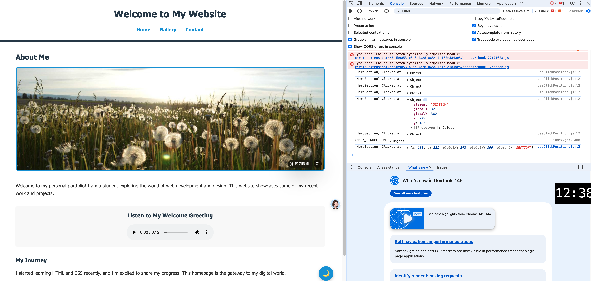

# Lab 4: ReactJS Hooks & Router

This lab focuses on advanced React concepts, including custom hooks, state management with Context API, and client-side routing.

## Assignment No 1: Create a Custom Hook for Click Position Logging

### Objective
Design a custom hook called `useClickPosition`. This hook should accept a `logName` as an input parameter.

### Functionality
When a user clicks within a designated area, the hook logs the click details (x, y coordinates relative to the element) and indicates which specific area was clicked. 
- **Implementation**: The hook is implemented in `src/hooks/useClickPosition.js` and applied to the "About Me" section on the Home page.

---

## Assignment No 2: Refactor Dark Mode Using Context Hook

### Objective
Update the dark mode functionality from Lab 3 by refactoring it to use the React context hook.

### Functionality
This refactor improves state management and modularity. Instead of passing props down manually, the theme state is managed globally.
- **Implementation**: Created `ThemeContext` in `src/context/ThemeContext.jsx`. The `ThemeProvider` wraps the entire app in `main.jsx`, allowing any component to toggle or consume the theme via the `useTheme` hook.

---

## Assignment No 3: Implement Gallery Page with Routing

### Objective
Leverage routing to set up a dedicated Gallery page.

### Functionality
Integrate the Gallery component (previously designed in Lab 3) as a new page in the application.
- **Implementation**: 
    - The Gallery page is accessible via the URL path `/gallery`.
    - Integrated logic from the previous Projects page into `GalleryPage.jsx`.
    - Configured React Router in `App.jsx` and updated the `Header` navigation.
